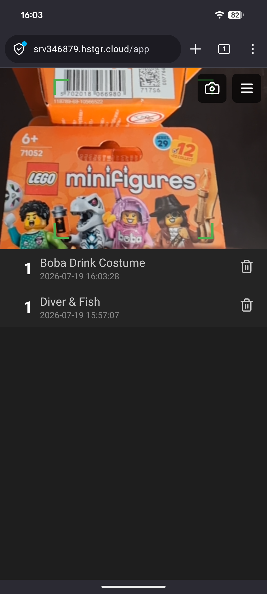

# DMS — Data Matrix Scanner

A small web app that turns your phone into a Data Matrix scanner. Point the
camera at a code, and DMS decodes it and adds it to a running list of scans.

Everything happens on your phone. There is no account, no login, and nothing is
uploaded anywhere — your scan list lives in your browser's own storage and stays
there until you delete it. Once loaded, the app also works offline.

Note, that if the app is run in an incognito/private tab, the data is lost when
the tab is closed, which is considered intended behaviour.

**Live app:** <https://srv346879.hstgr.cloud/app/>



### Scanning minifigure packages

<video src="https://github.com/RoboCtrl/dms/raw/main/docs/example.mp4" width="336" controls muted playsinline poster="docs/Screenshot_main_screen.png">
  Your browser does not display embedded video.
</video>

[▶ Watch the demo video](docs/example.mp4) (if the player above does not load)

## Motivation

This app was developed after a scanner app intended to identify the content of
LEGO minifigure packages stopped working because no updates for new minifigure
codes was provided by the developer.

This app is designed to work even if no updates are available by:
- Identifying duplicates
- Allowing to add your own code entries if none are provided

Key design features also include:
- Standalone app - no account, login, install required. Just a standalone
  webpage utilizing internal storage.
- No ads, no data sharing, no profiling, no targeting

The app works with any data matrix code, but the design features are aimed at
minifigure codes.


---

## Quick start

1. Open the app in Chrome or Firefox on your phone.
2. Allow camera access when the browser asks. (The app is useless without it.)
3. Hold a Data Matrix code in the camera view. When it is recognised the picture
   freezes for a moment, the code is outlined, and the decoded text appears at
   the top and as a new entry in the list below.

That's the whole loop. Everything below is detail and fine-tuning.

## The main screen

The screen is split in two: the **camera** on top, the **scan list** underneath.

Two buttons sit over the camera view:

- **Camera button** — switches the camera off and on. Handy when you want to
  read the list without the camera running (it also saves battery).
- **Menu button (☰)** — opens the Options panel.

When a code is found, the camera image freezes briefly so you can see what was
picked up. How long it stays frozen is up to you — see *Scanner freeze* below.

## The scan list

Each row shows the decoded content with its scan time underneath, and a counter
on the left telling you how often that code has been scanned. On the right is a
trash button to delete the entry.

- **Delete** — tap the trash icon. A bar appears at the bottom with **Undo
  delete**; tap it to bring the entry back. Only the most recent deletion can be
  undone.
- **Highlight** — press and hold an entry for about half a second to mark it.
  Highlighting is just a visual aid for keeping track of what you have already
  dealt with; it is not saved and disappears when you reload the app.

### Duplicates and grouping

By default, scanning the same code twice does not create a second row — the
counter on the existing row goes up instead. That behaviour is controlled by two
settings in the Options panel:

**Hide duplicates** (on by default) decides whether repeat scans collapse into
one row or each get their own.

**Grouping mode** decides what counts as "the same" code. This matters when your
codes contain several parts separated by spaces (for example `6603331 A 12 4`):

| Mode | What is treated as the same code |
|---|---|
| Only group full matches | The entire content must be identical. |
| Group by first token *(default)* | The first part before a space. |
| Group on first token suffix | The last two characters of the first part. |
| Group on second token | The second part. |
| Never group | Nothing is grouped; every scan gets its own row. |

If content is too short for the chosen mode (say there is no second part), that
entry simply stands on its own with a count of 1.

## Options

Open the panel with the ☰ button.

**Theme** — dark or light.

### Scanner

- **Camera viewport height** — how much of the screen the camera takes up, from
  a quarter up to about 60%. Give the camera more room for tricky codes, less
  room to see more of your list.
- **Scanner freeze** — what happens after a code is recognised. Pick one of:
  - *Continue after* — freeze for a fixed time, then carry on by itself.
  - *Tap to continue* — stay frozen until you tap the image. The slider sets a
    short pause afterwards so you don't immediately re-scan the same code.
  - *Automatic unfreeze* — resume as soon as the code leaves the view. The
    slider sets how long the code must be gone before scanning restarts.

  On every slider, **left is the longest delay and right the shortest**.
- **Fade-off animation** and **Animation duration** — the little fade when a
  frozen frame is dismissed. Turn it off if you prefer instant.

### Database

Shows how many list entries and catalog entries you have and how much storage
they take up.

- **Manage database** — a fuller view where you can tick several entries and
  delete them in one go, or clear the list or the catalog entirely. Clearing
  cannot be undone.
- **Load from URL…** and **Import catalogs** — see below.

## Catalogs (optional)

A catalog is a lookup table that gives your codes friendly names. Instead of a
row reading `6603331`, it reads *Mech T-Rex*. If a scanned code contains a word
that the catalog knows, the catalog's text is shown in its place; anything not
in the catalog is displayed as scanned.

To load one:

- **Import catalogs** lists the catalog files published alongside the app —
  pick one and load it.
- **Load from URL…** lets you type the address of your own catalog folder.
  **Preview** shows what a file contains before you commit; **Load** imports it.

Catalog files are JSON, mapping each code to a name:

```json
{
  "6603331": { "rn": 1, "text": "Mech T-Rex" },
  "6603321": { "rn": 2, "text": "Diver & Fish" }
}
```

Catalogs are stored on your device like everything else and can be removed again
under *Manage database*.

## Good to know

- **Data Matrix only.** QR codes and barcodes are not decoded.
- **Portrait orientation.** The layout is built for holding the phone upright.
- **HTTPS required.** Browsers only grant camera access to secure pages, so the
  app must be opened over `https://` (or `localhost`).
- **Your data is local.** Clearing your browser's site data for the app also
  wipes your scan list and catalogs. There is no backup or sync.

### If something doesn't work

- *No camera image* — check that you allowed camera access. If you dismissed the
  prompt, re-enable it in the browser's site settings and reload.
- *Codes are not recognised* — improve the lighting, hold steadier, and try
  moving slightly further away; a code that fills the whole view often decodes
  worse than one with some margin around it.
- *The app looks out of date after an update* — fully close the browser (on
  Android, quit the app rather than just switching away) and open it again so
  the cached version is refreshed.

---

## Installing the app

DMS works straight from the browser — installing is optional. Doing it gives you
a home-screen icon, a full screen without browser chrome, and offline use.

### Android — Chrome

1. Open <https://srv346879.hstgr.cloud/app/>.
2. Tap the ⋮ menu.
3. Choose **Install app** (or **Add to Home screen**) and confirm.

Chrome often offers an install banner by itself after the first visit.

### Android — Firefox

1. Open the app.
2. Tap the ⋮ menu.
3. Choose **Install** / **Add to Home screen** and confirm.

### iPhone / iPad

Installation must be done from **Safari** — other iOS browsers cannot install
web apps or cache them for offline use.

1. Open the app in Safari.
2. Tap the Share button.
3. Choose **Add to Home Screen**.

### After installing

Launch DMS from the home-screen icon. It will ask for camera permission once,
then work like any other app — including without a network connection, as long
as you have opened it online at least once.

To remove it, delete the icon the same way you would uninstall any app. That
removes the shortcut; to also erase your scans, clear the site data for
`srv346879.hstgr.cloud` in your browser settings, or use **Clear all** in the
app's *Manage database* panel first.

### Running your own copy

The app is plain static files with no backend. Copy the `www/` folder to any web
server that serves it over HTTPS and it will run as-is. Details are in
[docs/deployment.md](docs/deployment.md); developer documentation is in
[docs/README.md](docs/README.md).

---

## License

DMS is released under the **MIT License** — see [LICENSE](LICENSE) for the full
text. In short: you may use, copy, modify, and redistribute the app, including
commercially, as long as the copyright notice and licence text travel with it.
The software comes with no warranty.

© 2026 RoboCtrl
